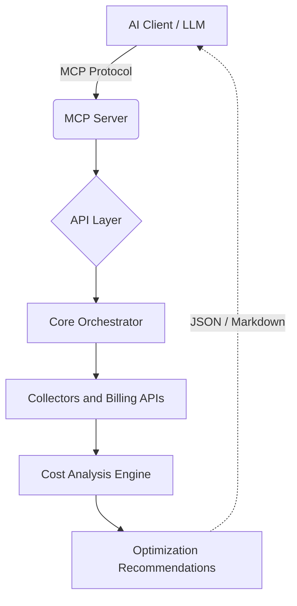

# 🚀 Super Quick Start (Beginner Friendly)

1. **Clone repository**
```bash
git clone https://github.com/Moiz-Ali-Moomin/mcp-cloud-finops-ai-agent.git
cd mcp-cloud-finops-ai-agent
```

2. **Create Python environment**
*macOS / Linux*
```bash
python3 -m venv .venv
source .venv/bin/activate
```
*Windows*
```bash
python -m venv .venv
.venv\Scripts\activate
```

3. **Install dependencies**
```bash
pip install -e .
```

4. **Configure credentials**
Set these environment variables (examples):
*macOS / Linux*
```bash
export AWS_PROFILE=default
export GOOGLE_CLOUD_PROJECT=my-project
export AZURE_SUBSCRIPTION_ID=my-sub-id
```
*Windows*
```powershell
$env:AWS_PROFILE="default"
$env:GOOGLE_CLOUD_PROJECT="my-project"
$env:AZURE_SUBSCRIPTION_ID="my-sub-id"
```

5. **Start MCP server**
```bash
opsyield-mcp
```
The server will start and wait silently for JSON-RPC MCP client connections over stdio.

6. **Connect Claude Desktop**
Add to your Claude Desktop config:
```json
{
  "mcpServers": {
    "opsyield-finops": {
      "command": "opsyield-mcp"
    }
  }
}
```

7. **Test queries**
Try asking:
- "Show my AWS costs for the last 30 days"
- "List idle resources in my GCP project"
- "Estimate Azure monthly spend"

---

# ☁️ OpsYield MCP FinOps Server
<!-- GitHub Topics: finops, mcp, multi-cloud, cloud-cost-optimization, devops, ai-agent -->

<p align="center">
  <em>An open source, multi-cloud FinOps Model Context Protocol (MCP) server for discovering, analyzing, and optimizing cloud costs via AI agents.</em>
</p>

## 📖 Project Overview

**OpsYield MCP FinOps Server** is an infrastructure intelligence platform that empowers AI agents to interact directly with your cloud environments to perform deep financial operations (FinOps) analysis and cost optimization. 

In a modern multi-cloud landscape, maintaining visibility over sprawl—forgotten environments, over-provisioned compute, and unattached disks—is a major challenge. The OpsYield platform solves this by bridging the gap between raw cloud billing APIs and Large Language Models. 

By exposing standard functions through the **Model Context Protocol (MCP)**, AI agents (like Claude Desktop) can instantly query live data from AWS, GCP, and Azure. With OpsYield as the backend, your AI agent transforms into an interactive Platform Engineer capable of analyzing cloud spending trends, generating rightsizing reports, and identifying wasted spend in real time.

> [!WARNING]
> **Cloud Spending Alert**: This tool queries billing and cost APIs. Large queries or high-frequency polling may incur API costs or data egress charges depending on your cloud provider's pricing tier (e.g., BigQuery analysis costs for GCP).

---

## ✨ Features

- **Multi-Cloud Support**: Single plane of glass for AWS, GCP, and Azure cost intelligence.
- **FinOps Cost Analysis**: Consolidate real-time spend analytics and highlight spending anomalies.
- **Idle Resource Detection**: Deep collector integrations proactively hunt down unattached disks, idle load balancers, and orphaned IPs.
- **Rightsizing Recommendations**: Get specific down-scaling suggestions based on trailing utilization metrics.
- **AI-Native MCP Interface**: Fully supports Anthropic's Model Context Protocol over `stdio` or `SSE` for seamless integration into Desktop and CLI LLM clients.
- **Modular Cloud Architecture**: Abstraction layers make adding new provider metrics or heuristic rules trivial.
- **Docker-Ready Deployment**: Ship safely with isolation and explicit environment variables via pre-configured Docker containers.

---

## 🏗️ Architecture Overview

The system operates continuously via the MCP transport format. When an AI client receives a natural language query, it translates the intent to an MCP Tool Call. The OpsYield Orchestrator receives the call, routes it to the specific Cloud abstraction, fetches telemetry and billing data, passes the data through the FinOps Heuristic Engine, and responds with structured intelligence.



---

## 🚀 Quick Start (Local Setup)

### 1. Prerequisites
- **Python 3.10+** (Recommended: 3.13)
- **pip** (Python package manager)
- **Cloud Accounts**: Active credentials for at least one provider (AWS, GCP, or Azure).

### 2. Installation
Clone the repository and install dependencies:

```bash
git clone https://github.com/Moiz-Ali-Moomin/mcp-cloud-finops-ai-agent.git
cd mcp-cloud-finops-ai-agent
pip install -e .
```

---

## 🔐 Cloud Authentication Setup

The server requires specific permissions to analyze your clouds.

### 🔵 Google Cloud Platform (GCP)
1.  **Service Account**: Create a Service Account in the [GCP Console](https://console.cloud.google.com/iam-admin/serviceaccounts).
2.  **Permissions**: Assign the following roles:
    *   `BigQuery Data Viewer`
    *   `BigQuery Job User`
    *   `Compute Viewer` (for resource discovery)
3.  **JSON Key**: Generate a JSON key and save it locally. Set the path in `GOOGLE_APPLICATION_CREDENTIALS`.
4.  **Billing Export**: Ensure **Billing Export to BigQuery** is enabled in your Billing Account settings.

### 🟠 Amazon Web Services (AWS)
1.  **IAM User**: Create an IAM user or role.
2.  **Permissions**: Attach a policy with:
    *   `ce:GetCostAndUsage` (Cost Explorer)
    *   `ec2:DescribeInstances`
    *   `s3:ListAllMyBuckets`
3.  **CLI Config**: Run `aws configure` to set up your local credentials profile.

### ⚪ Microsoft Azure
1.  **Service Principal**: Create an App Registration (Service Principal) in Azure AD.
2.  **Secret**: Create a Client Secret.
3.  **Permissions**: Assign the `Cost Management Reader` role at the Subscription level.
4.  **Env Vars**:
    *   `AZURE_CLIENT_ID`: Your App Registration ID.
    *   `AZURE_CLIENT_SECRET`: Your Client Secret.
    *   `AZURE_TENANT_ID`: Your Directory ID.
    *   `AZURE_SUBSCRIPTION_ID`: Your Subscription ID.

---

## 🐳 Docker Usage

To run OpsYield isolated from your local environment, use the provided Dockerfiles.

1. Create an environment file defining your cloud variables:
   ```bash
   cp .env.example .env
   # Edit .env to add your keys
   ```

2. Build and run using Docker Compose:
   ```bash
   docker-compose up --build
   ```
   
   *Alternatively, using standard Docker CLI:*
   ```bash
   docker build -t opsyield .
   # Run MCP server:
   docker run --env-file .env -i opsyield opsyield-mcp
   # Run REST API:
   docker run --env-file .env -p 8000:8000 opsyield opsyield-api
   ```

---

## 🤖 Claude Desktop Configuration

> **Correction Notice**: The command to start the MCP server is `opsyield-mcp`, replacing the old `opsyield-server` command.

To use OpsYield natively in Claude Desktop, add the server to your configuration file (usually found at `%APPDATA%\Claude\claude_desktop_config.json` on Windows):

```json
{
  "mcpServers": {
    "opsyield-finops": {
      "command": "opsyield-mcp",
      "args": [],
      "env": {
        "GOOGLE_APPLICATION_CREDENTIALS": "C:\\path\\to\\gcp-sa.json",
        "GOOGLE_CLOUD_PROJECT": "your-project-id",
        "AWS_PROFILE": "default",
        "AZURE_SUBSCRIPTION_ID": "your-sub-id"
      }
    }
  }
}
```

---

## 💬 Example Queries

Once you have successfully integrated the OpsYield MCP Server with your AI Agent, you can leverage these prompts to explore platform intelligence:

- **Showing AWS Costs**: *"Show me the cost summary for AWS over the last 30 days. Group the cost by service."*
- **Detecting Idle Resources**: *"Analyze my GCP project and list any idle compute resources or unattached persistent disks."*
- **Identifying Expensive Services**: *"What are the top 3 most expensive services running in my Azure subscription this month?"*
- **Suggesting Cost Optimizations**: *"Are there any rightsizing recommendations or optimization strategies to apply to my EC2 environment?"*
- **Forecasting Spend**: *"Taking into account historical data, what is the forecasted 30-day additional spend across all clouds?"*

---

## 📂 Project Structure

A brief overview of the core architectural domain boundaries:

- **`opsyield/api`**: FastAPI HTTP/SSE configurations, API routes, adapter layers, and the primary MCP Server entry points.
- **`opsyield/analysis`**: The brain of the application containing logic for anomaly detection, rightsizing heuristics, and waste calculations.
- **`opsyield/billing`**: Data schemas mapping raw external provider APIs (e.g., Azure Cost Management, AWS CE) into unified internal objects.
- **`opsyield/collectors`**: Scripts mapping exact read-only queries against cloud compute/storage infrastructures to gather telemetry metadata.
- **`opsyield/core`**: The foundational models, structured logging configurations, cross-cloud aggregation engine, and operational orchestrators.
- **`opsyield/providers`**: Abstraction factory defining the standard interfaces `get_cost_summary()`, `get_idle_resources()`, etc. for each cloud.
- **`opsyield/optimization`**: Strategy implementations that generate discrete, actionable fix commands from the provided analyses.
- **`opsyield/utils`**: Global helpers for dates, serialization, string sanitization, and network retry logic. 

---

## ❓ Troubleshooting

- **GCP 404 (Table Not Found)**: Verify that your Billing Export dataset name matches the expected pattern in `mcp_server.py`.
- **AWS Permission Denied**: Ensure "Cost Explorer" is enabled in the AWS Billing console (it's often disabled by default).
- **Timeout Errors**: If queries take >60s, check your network or try reducing the `days` parameter.

---

## 🗺️ Roadmap

- [ ] Add explicit cost anomaly detection and automated baseline alerts.
- [ ] Implement multi-variate cost forecasting.
- [ ] Add deep Kubernetes cost analysis via `Kubecost` or `OpenCost` APIs.
- [ ] Introduce direct Slack alerts for anomaly spikes.
- [ ] Develop automated weekly PDF/HTML optimization reports.
- [ ] Integrate Terraform parsing to catch cost escalations *before* deployment.

---

## 🤝 Contributing

We actively encourage and welcome community contributions! Please review the rules and setup structures before submitting Pull Requests:
1. Review the [`CONTRIBUTING.md`](CONTRIBUTING.md) guide for local environment setup (`make install`, `make test`, local virtualenvs).
2. Review our [`CODE_OF_CONDUCT.md`](CODE_OF_CONDUCT.md).
3. Ensure you've run both `make lint` and `make format` across all files.

---

## 📜 License

This project is licensed under the **MIT License**. See the [`LICENSE`](LICENSE) file for details.
