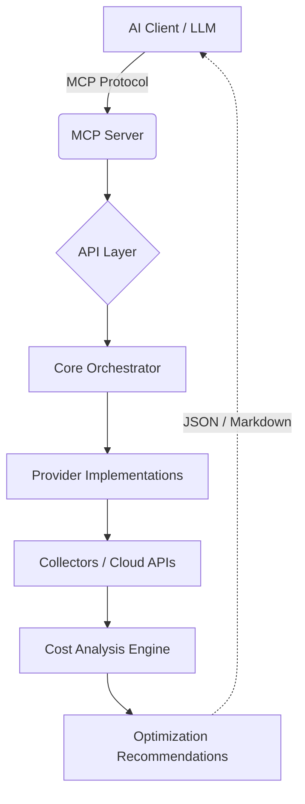

# ☁️ OpsYield MCP FinOps Server
<!-- GitHub Topics: finops, mcp, multi-cloud, cloud-cost-optimization, devops, ai-agent, kubernetes, opencost -->

<p align="center">
  <em>An open source, multi-cloud FinOps Model Context Protocol (MCP) server for discovering, analyzing, and optimizing cloud costs via AI agents.</em>
</p>

## 📖 What the Project Does

**OpsYield MCP FinOps Server** is an infrastructure intelligence platform that empowers AI agents to interact directly with your cloud environments to perform deep financial operations (FinOps) analysis and cost optimization. 

In a modern multi-cloud landscape, maintaining visibility over sprawl—forgotten environments, over-provisioned compute, unattached disks, and expansive Kubernetes clusters—is a major challenge. The OpsYield platform solves this by bridging the gap between raw cloud billing APIs and Large Language Models. 

By exposing standard functions through the **Model Context Protocol (MCP)**, AI agents (like Claude Desktop) can instantly query live data from AWS, GCP, Azure, and Kubernetes. With OpsYield as the backend, your AI agent transforms into an interactive Platform Engineer capable of analyzing cloud spending trends, generating rightsizing reports, and identifying wasted spend in real time.

> [!WARNING]
> **Cloud Spending Alert**: This tool queries billing and cost APIs. Large queries or high-frequency polling may incur API costs or data egress charges depending on your cloud provider's pricing tier.

---

## ✨ Key Features

- **Multi-Cloud Support**: Single plane of glass for AWS, GCP, Azure, and Kubernetes cost intelligence.
- **FinOps Cost Analysis**: Consolidate real-time spend analytics and highlight spending anomalies.
- **Idle Resource Detection**: Deep collector integrations proactively hunt down unattached disks, idle load balancers, and orphaned IPs.
- **Rightsizing Recommendations**: Get specific down-scaling suggestions based on trailing utilization metrics.
- **AI-Native MCP Interface**: Fully supports Anthropic's Model Context Protocol over `stdio` or `SSE` for seamless integration into Desktop and CLI LLM clients.
- **Modular Cloud Architecture**: Abstraction layers make adding new provider metrics or heuristic rules trivial.
- **Docker-Ready Deployment**: Ship safely with isolation and explicit environment variables via pre-configured Docker containers.

---

## 🏗️ Architecture Overview

The system operates continuously via the MCP transport format. When an AI client receives a natural language query, it translates the intent to an MCP Tool Call. The OpsYield Orchestrator receives the call, routes it to the specific Cloud abstraction, fetches telemetry and billing data, passes the data through the FinOps Heuristic Engine, and responds with structured intelligence.



---

## 🚀 Installation Instructions

### Prerequisites
- **Python 3.10+** (Recommended: 3.13)
- **pip** (Python package manager)
- **Cloud Accounts**: Active credentials for at least one provider (AWS, GCP, Azure, or Kubernetes with OpenCost).

### Local Setup
Clone the repository and install dependencies:

```bash
git clone https://github.com/Moiz-Ali-Moomin/mcp-cloud-finops-ai-agent.git
cd mcp-cloud-finops-ai-agent

# Create virtual environment
python3 -m venv .venv

# Activate it
# macOS / Linux:
source .venv/bin/activate
# Windows:
.venv\Scripts\activate

# Install package
pip install -e .
```

---

## ⚙️ Environment Configuration

The server requires specific permissions to analyze your clouds. Copy the environment example to start:

```bash
cp .env.example .env
```

Set these environment variables within `.env` or in your system:

### 🔵 Google Cloud Platform (GCP)
Set `GOOGLE_APPLICATION_CREDENTIALS` to the path of your Service Account JSON key (requires `BigQuery Data Viewer`, `BigQuery Job User`, and `Compute Viewer`), and `GOOGLE_CLOUD_PROJECT` to your project ID. Ensure Billing Export to BigQuery is enabled.

### 🟠 Amazon Web Services (AWS)
Set `AWS_PROFILE` if using local `~/.aws/credentials`, or provide `AWS_ACCESS_KEY_ID`, `AWS_SECRET_ACCESS_KEY`, and `AWS_REGION`. Ensure your IAM user has `ce:GetCostAndUsage`, `ec2:DescribeInstances`, and `s3:ListAllMyBuckets`.

### ⚪ Microsoft Azure
Set `AZURE_CLIENT_ID`, `AZURE_CLIENT_SECRET`, `AZURE_TENANT_ID`, and `AZURE_SUBSCRIPTION_ID`. Ensure the Service Principal has the `Cost Management Reader` role.

### ☸️ Kubernetes (OpenCost)
Set `OPENCOST_URL` to the endpoint of your OpenCost installation (default is `http://localhost:9003`).

---

## 🔌 Running the MCP Server

The MCP server exposes standard tools natively to AI agents over standard I/O streams.

```bash
opsyield-mcp
```
The server will start and wait silently for JSON-RPC MCP client connections.

### Connect Claude Desktop
Add to your Claude Desktop config (`claude_desktop_config.json`):
```json
{
  "mcpServers": {
    "opsyield-finops": {
      "command": "opsyield-mcp",
      "args": [],
      "env": {
        "OPENCOST_URL": "http://localhost:9003",
        "AWS_PROFILE": "default",
        "GOOGLE_CLOUD_PROJECT": "my-project"
      }
    }
  }
}
```

---

## 🌐 Running the FastAPI API

You can also run the system as a standard REST API backend:

```bash
uvicorn opsyield.api.main:app --host 0.0.0.0 --port 8000
```
This enables the API endpoints, Server-Sent Events (SSE) for MCP, and provides interactive Swagger documentation at `http://localhost:8000/docs`.

---

## 💬 Example Queries

Try asking your AI agent these natural language questions:

- **Showing AWS Costs**: *"Show me the cost summary for AWS over the last 30 days. Group the cost by service."*
- **Kubernetes Spend**: *"What are my Kubernetes costs aggregated by namespace using the OpenCost collector?"*
- **Detecting Idle Resources**: *"Analyze my GCP project and list any idle compute resources or unattached persistent disks."*
- **Identifying Expensive Services**: *"What are the top 3 most expensive services running in my Azure subscription this month?"*
- **Suggesting Cost Optimizations**: *"Are there any rightsizing recommendations or optimization strategies to apply to my EC2 environment?"*

---

## ☸️ Kubernetes Cost Integration via OpenCost

The platform treats Kubernetes as a top-level cloud provider. Instead of reinventing complex container cost allocation, OpsYield integrates seamlessly with the **OpenCost REST API**.

The `KubernetesProvider` dynamically polls the OpenCost `/allocation` and `/assets` endpoints to normalize multi-tenant container spending (such as cost-per-namespace) into the unified OpsYield FinOps engine. This allows your AI agent to correlate node-level EC2 costs with workload-level Kubernetes spending in a single conversation. Just ensure `OPENCOST_URL` is set!

---

## 📂 Project Structure Overview

A brief overview of the core architectural domain boundaries:

- **`opsyield/api`**: FastAPI HTTP/SSE configurations, API routes, adapter layers, and the primary MCP Server entry points.
- **`opsyield/analysis`**: The heuristic engine containing logic for anomaly detection, rightsizing, and wasting calculations.
- **`opsyield/collectors`**: Specialized modules directly communicating with specific cloud telemetry or billing APIs (e.g., OpenCost, AWS CE).
- **`opsyield/providers`**: The dynamic factory and abstraction unified classes acting as a wrapper over the collectors (`CloudProvider`).
- **`opsyield/core`**: Foundational Pydantic models, structured logging, and internal utilities.

---

## 💻 Development Setup

If you wish to modify the code or add a new provider:

```bash
# Set up a virtual environment
python -m venv .venv
source .venv/bin/activate

# Install with development dependencies
make install
```

---

## ✅ Running Tests

We use `pytest` for unit and integration testing:

```bash
make test
```

---

## 🤝 Contributing

We actively encourage and welcome community contributions! Please review the rules and setup structures before submitting Pull Requests:
1. Review the [`CONTRIBUTING.md`](CONTRIBUTING.md) guide for local environment setup, architecture bounds, and code style.
2. Review our [`CODE_OF_CONDUCT.md`](CODE_OF_CONDUCT.md).
3. Ensure you've run both `make lint` and `make format` across all files.

---

## 📜 License

This project is licensed under the **MIT License**. See the [`LICENSE`](LICENSE) file for details.
